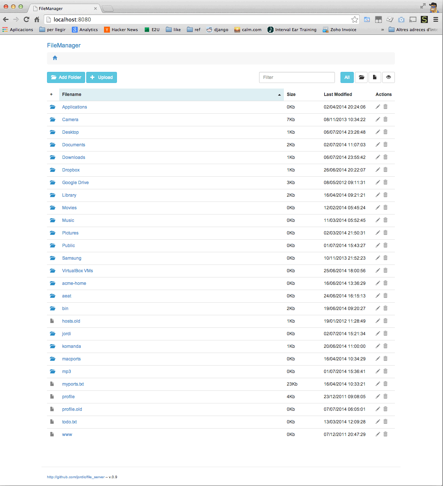

### Html5 FileBrowser, Angular + Go



#### Features

- Fast UI. Json + angular
- Inline search
- Upload mutliple files.
- Big uploads. Tested with 1G files. ( Uploads are streamed to disk )
- File delete / remove
- Dir creation
- Also can act as an api file json server... ( Improbed in future relases )
    + PUT /dir file
    + GET /dir &format=json
    

#### Install

Donwload a binary build:

- [Osx 64bits](builds/file_server_osx)
- [Linux 64bits](builds/file_server_linux_amd64)

Or compile it:
```go
go get github.com/jordic/fileserver
go build or go install
```

#### Browser compatibility
- Firefox, safari, Chrome.
- Perpahs ie10 but not tested


##### @Todo

+ ~~Add some type of flahs session, to notify user after an upload~~
+ ~~Add the current path, and a direct acces to parent path~~
- ~~Add file operations, like delete, move or~~ uncompress zip files..
- Big code refactor to milestone 1.0.
    - PACKAGE filsistem json .. with common operations... 
    - Frontend
- Improbe filesystem json server.
    - Add param for CORS handling
- Add some kind of authentification
- Add javascript dependencies to main file (Actually loading them async from cdn )
- Add some kind of permisions...
- Review log system.


##### Changelog

###### v0.9
+ Big refactor using Angular for frontend and api calls for actions

###### v0.5
+ Added version number
+ File deleting operations


